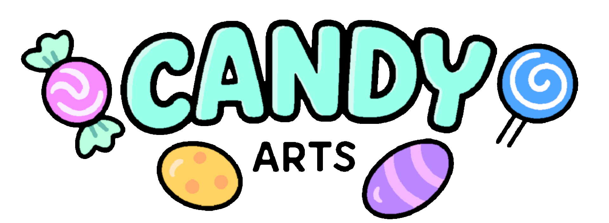

# Candy Dialogue Engine
**[Candy Dialogue Engine](https://candy-arts.com/index.php/candy-dialogue-engine) by [Candy Arts](https://candy-arts.com) is an extensive and powerful Dialogue System for Godot 4. More than that, it's also a Visual Novel Engine, Media Synchronizer, Cutscene Orchestrator, Narrative Manager, and Mod Support Solution.**

*Disclaimer: Images in this document provided for illustrative purposes. Images were rendered in-engine using Candy DE's capabilities and may include AI-generated art assets.*

## Table of Contents
- [Features](#features)
- [Candy Dialogue Creator](#candy-dialogue-creator)
- [Instructions](#instructions)
- [Pricing](#pricing)
- [Compatibility](#compatibility)
- [Bugs and issues](#bugs-and-issues)
- [Feedback](#feedback)

## Features

**Candy Dialogue Engine was designed to achieve five core goals:**
1. Make dialogues fast and simple to write.
2. Adapt to any game type or genre.
3. Provide or support any features developers may need.
4. Make dialogue synchronization with game events easy.
5. Allow full code and UI customization.

**To that end, Candy Dialogue Engine combines the usual tools you need for speech and narrative crafting, plus more:**  
- Different dialogue modes with various settings and options: dialogue box with portrait, subtitles, speech bubbles, chat box…
- Voiced dialogue support.
- VN busts and background image display.
- Full UI customization without coding.
- Branching dialogues / Conditions.
- Call functions and emit/detect signals.
- Player choices and input prompts.

- Media playback controls.
- Variable modification and display.
- Cutscene scripting.
- Gender-based word substitution (or other attributes).
- Gendered and random variants (or other attributes).
- Lexicon (Glossary).

- Localization/Translation features.
- Support features for Text-To-Speech and LLM-generated dialogue.
- Dialogue live edit at runtime, parallel dialogues, dialogues as a modding/programming layer.
- Fully accessible and expandable code.
- Standalone dialogue editing GUI with simple ‘click to add line, fill in data, don’t type syntax’ approach.

You can see the extended feature list [here](Feature_List.md).

## Candy Dialogue Creator
Candy Dialogue Engine is intended to be used in conjunction with the [Candy Dialogue Creator](https://github.com/Candy-Arts/Candy-Dialogue-Creator): a free standalone GUI for creating and editing dialogues.

Candy Dialogue Creator writes and edits the dialogues, Candy Dialogue Engine runs them.

## Instructions
### Download
Download the [latest release](https://github.com/Candy-Arts/Candy-Dialogue-Engine/releases) of Candy Dialogue Engine. 
Remember to also download the latest release of [Candy Dialogue Creator](https://github.com/Candy-Arts/Candy-Dialogue-Creator/releases).

### Installation
**Installation is an easy 5-step process:**
1. Merge two folders.
2. Copy the merged folder to your Godot project.
3. Add two autoloads.
4. Add a few input actions.
5. Update UIDs.

See the detailed instructions [here](Installation_Instructions.pdf).

### Updating
**Drop one folder in your project and overwrite old files:**
- Any custom files or modifications you may make under normal use are kept safe thanks to the two-folder design during installation.
- On rare occasions, some updates may also require running a patcher: drop the provided patcher script in your project, right-click → "Run" in Godot, delete the script.
- Advanced users who make modifications to the engine code only need to backup the main .gd script.

See the detailed instructions [here](Update_Instructions.pdf).

### Get Started
After installation, read [this guide](Getting_Started.pdf) for important further instructions. 
The Documentation/Guides folder contains all the information you need to use Candy Dialogue Engine. 

## Pricing
We offer three license models: free (non-commercial projects), royalties, or one-time fee.

**Two licenses are provided with downloads of Candy Dialogue Engine:**
- Free Indie License: Completely free, for non-commercial use only.
- Studio License: 2.5% royalties on project's gross revenue.

**In addition, we offer very good deals for small indie developers:**
- Starter Indie License: €100 (€50 until September 2026), budget limit of €5'000 per project.
- Pro Indie License: €500 (€400 until September 2026), budget limit of €25'000 per project.

Indie licenses don't have a project limit: **Pay once - make as many games as you like, for life.**  
Flat fee, no revenue caps: if your game is a huge success and earns millions, you don't pay more. 
You can upgrade to the Studio license at any time if your project grows bigger. 
See our [Indie Project Checklist](https://candy-arts.com/index.php/indie-project-checklist/) to find out if your project qualifies.

**Studio License:**  
If your project is too big to qualify as indie or if you find royalties more affordable, you can use the Studio License.
- You only pay us 2.5% of your project's revenue, every 3 months.
- Earn 0, pay 0.
- No budget and team limits.

**Additional Info:**
- All licenses provide access to the complete features.
- When you apply a license to a project, we can't change the terms retroactively. No "Agree to the new license or remove Candy DE from your project".
- For a simplified overview of our license terms, see our [Licensing](https://candy-arts.com/index.php/licensing/) page.
- The full license texts can be found on [our website](https://candy-arts.com/index.php/licenses/).

**Purchase:**
- The Free Indie and Studio licenses don't require any upfront payment. They're included with downloads of Candy Dialogue Engine.
- You can purchase Starter Indie and Pro Indie licenses on our [Gumroad](https://candyarts.gumroad.com/).

Candy Dialogue Engine provides **a lot** of value in many ways: feature breadth and depth, time saved, the cost of making a comparable program in-house, a tool you can reuse for any future game instead or learning new ones... It can do a lot of the work in your game.

It's also built on a solid, modular core structure: this means there are almost no limits to how it can be expanded, and deep-rooted bugs that can't be fixed without major code rewrites are not a concern.

Importantly, Candy Dialogue Engine requires a lot of work to create and maintain: something of this scale can't be made by working on it a few hours on week-ends. This pricing model allows us to work on Candy Dialogue Engine full time, add features and improvements, and develop more assets that you might also find useful.

## Compatibility
Candy Dialogue Engine should work with any version of Godot 4.

It should also work with any operating system that Godot can compile for.

## Bugs and issues
Bugs should be reported here on GitHub.

We really don't expect security issues considering the nature of Candy Dialogue Engine, but if you find any, please [report them directly to us](https://candy-arts.com/index.php/contact/) (don't report them publicly: someone could exploit them).

## Feedback
We're looking forward to [user feedback](https://github.com/Candy-Arts/Candy-Arts/discussions/categories/candy-de-features) to help us improve Candy Dialogue Engine!

We certainly don't know everything about Godot, or all the different ways game devs might want to use Candy Dialogue Engine, so please let us know if a particular feature, dialogue mode or command could help you.

